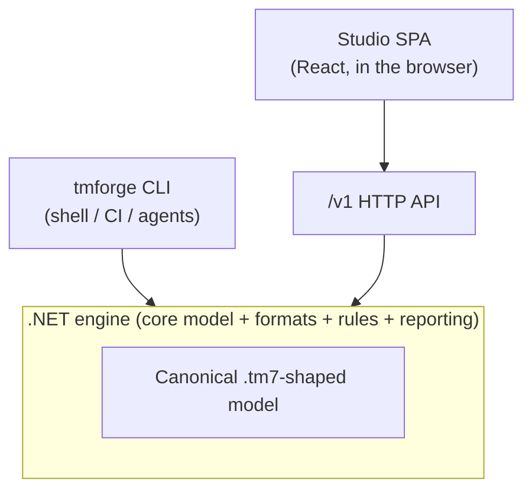

# Threat Model Forge documentation

Welcome to the user documentation for **Threat Model Forge** (`tmforge`), a cross-platform
toolkit for authoring, validating, and reporting on `.tm7`-compatible threat models: in the
browser, in the terminal, and in CI. It is an open, automatable successor to the Windows-only
Microsoft Threat Modeling Tool (MTMT).

## Start here

| If you want to | Read |
| --- | --- |
| Try it right now, no install (runs in your browser) | [Live demo](https://hacks4snacks.github.io/tmforge/) |
| Understand what the platform is and its features | [Overview & features](overview.md) |
| Get running in a few minutes | [Quick start](quickstart.md) |
| Install the CLI, container, or global tool | [Installation](installation.md) |

## Guides

| Guide | What it covers |
| --- | --- |
| [Overview & features](overview.md) | Concepts, the three surfaces (CLI, Studio, API), formats, and rules at a glance. |
| [Quick start](quickstart.md) | Author, analyze, and report on your first model. |
| [Installation](installation.md) | Prebuilt binaries, container images, the .NET global tool, and building from source. |
| [CLI reference](cli-reference.md) | Every `tmforge` command, its options, exit codes, and JSON output. |
| [Studio guide](studio-guide.md) | Browser-based diagram authoring with the React Studio SPA. |
| [Engine API reference](api-reference.md) | The versioned `/v1` HTTP surface and its endpoints. |
| [Formats & interoperability](formats.md) | `.tm7`, `tmforge-json`, draw.io, and Visio import/export and fidelity. |
| [Analysis rules & CI](analysis-rules.md) | The built-in rule set, rule packs, suppressions, and gating a build. |
| [Deployment](deployment.md) | Running the engine API + Studio in containers, Kubernetes, and CI/CD. |

## The three surfaces

Threat Model Forge is one engine with three faces, so the same model behaves identically whether
you drive it from a shell, a browser, or over HTTP.

- **CLI** (`tmforge`): headless, scriptable authoring, validation, reporting, and conversion.
- **Studio**: a React single-page app for drawing data-flow diagrams, served by the API.
- **Engine API** (`/v1`): a versioned HTTP surface that hosts Studio and exposes the engine to
  any client.

## Reference material

- Project [README](../README.md): build, test, and contribution entry point.
